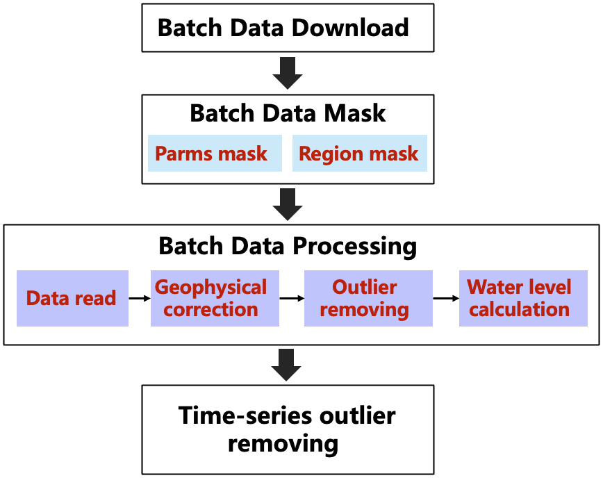

# swot-tool

processing tool for swot data.

## 1. swot pixel cloud data processing workflow
**The workflow has been applied to the large lake.** 

api reference:   
#### (1) utils.functions:
**<u>utils.functions.IQR_filter(arr)</u>**: Outliers removing for 1d/2d array.   
**<u>utils.functions.pix_to_slant_raster(pixc, key='height')</u>**: Convert pixel cloud data to raster under slant coordinate.   
**<u>utils.functions.pixc_geophy_cor(pixc_nc)</u>**: Geophysical correction for pixc data.     
**<u>utils.functions.swot_raster_reproj(raster_nc, epsg_from, epsg_to)</u>**: reproject swot raster data.    
#### (2) utils.swot_data_mask:
**<u>utils.swot_data_mask.swot_pixc_mask(pixc_nc, vars_sel, region_gpd, path_masked)</u>**: mask swot pixc data in terms of spatial region and variables.     
**<u>swot_raster_mask(raster_nc, vars_sel, region_gpd, path_masked)</u>**: mask swot raster data in terms of spatial region and variables.      

